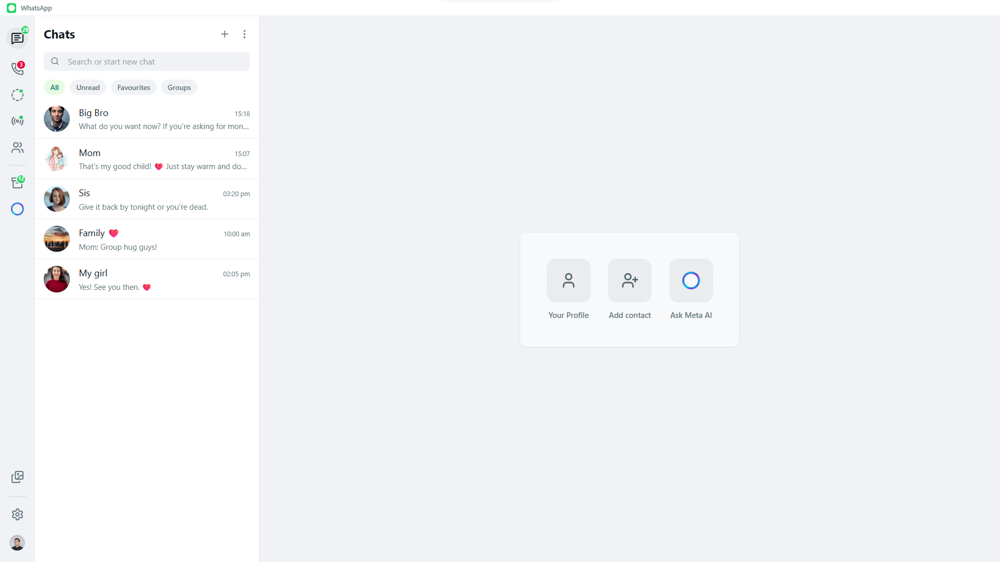

# WhatsApp Persona Simulation Environment (v1.0)

A high-fidelity WhatsApp Web replica built with **React 19**, **Vite**, and **Tailwind CSS v3**, integrated with **Google Gemini** to provide a sophisticated AI persona simulation experience.




---

## 🚀 Overview

This project is a pixel-perfect reconstruction of the WhatsApp interface, repurposed as a playground for AI-driven character simulations. It features single and group chat dynamics where every "Contact" is an autonomous AI persona powered by Google's Gemini LLM. Now I can always use whatapp when my friends are using it as well. Hehehe...

### 🌟 Key Features (v1.0)
*   **Gemini AI Personalities**: Each contact has a unique role, speech style, and system instructions.
*   **Model Selection & Privacy**: Switch between different Gemini engines (Flash, Pro, Lite) and toggle context-sharing (date/time/calendar) in the Settings menu.
*   **Calendar & Notes Integration**: Provide real-time date context and custom notes to the AI via a dedicated Calendar widget.
*   **Authentic Mobile UX**: True-to-life mobile UI with an auto-expanding input area, real WhatsApp grid attachment menu, and hardware back-button support to prevent accidental app exits.
*   **Deep Memory Reset**: "Clear Chat" wipes both the UI and the AI's contextual memory, providing a true fresh start.
*   **Mobile-First Action Hub**: A dedicated Floating Action Button (FAB) provides quick access to all management features on mobile devices.
*   **Safety Confirmations**: Integrated confirmation dialogs for all destructive actions to prevent accidental data loss.
*   **Persistent Meta AI**: A permanent AI assistant chat (Meta AI) is always available and undeletable, linked via landing page shortcuts.
*   **IndexedDB Media Persistence**: Images and documents are stored locally using IndexedDB for robust persistence across sessions.
*   **Cyber-Noir Aesthetic**: Premium dark/light mode support with animated transitions and native-style wallpapers.
*   **Natural Message Splitting**: AI responses are split into human-like chunks based on sentence structure for a more realistic chat feel.

---

## 🛠 Tech Stack

*   **Framework**: [React 19](https://react.dev/)
*   **Build Tool**: [Vite 6](https://vitejs.dev/)
*   **Styling**: [Tailwind CSS v3](https://tailwindcss.com/)
*   **Icons**: [Lucide React](https://lucide.dev/)
*   **AI SDK**: [@google/genai](https://www.npmjs.com/package/@google/genai)
*   **Storage**: [Dexie.js / IndexedDB](https://dexie.org/)

---

## 📦 Architecture

-   **/components**: UI components (Sidebar, ChatList, ChatWindow, ProfilePanel, MobileActionFAB).
-   **/services**: Core logic for Gemini API interactions and message handling.
-   **/utils**: Storage utilities for IndexedDB media management.
-   **/constants.ts**: Initial state and theme configuration.
-   **App.tsx**: Main state orchestration and AI turn-taking logic.

---

## 🚦 Local Development

### Prerequisites
1.  Node.js (v18+)

### Setup Instructions

1.  **Clone the Repository**:
    ```bash
    git clone https://github.com/sobiswriter/Wassap.git
    ```
    

2.  **Install Dependencies**:
    ```bash
    npm install
    ```

3.  **Run Dev Server**:
    ```bash
    npm run dev
    ```

> [!NOTE]
> **API Key Integrated**: For a seamless experience, a Gemini API key is already integrated into the application. No manual environment configuration or `.env` files are required for local development.

4.  **Access the App**:
    Open `http://localhost:5173`.

---

## 📜 License

This project is intended for educational and simulation purposes. WhatsApp is a trademark of Meta Platforms, Inc.

---

*Developed with ❤️ by sobiswriter*
