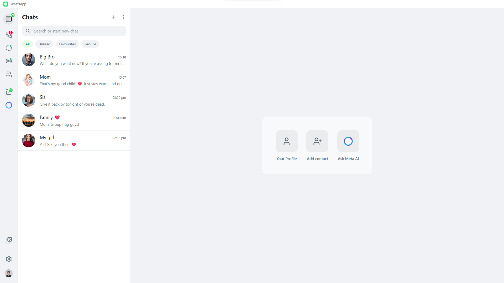

# Wassap Persona Simulation (v1.3.0)

A high-fidelity WhatsApp Web replica built with **React 19**, **Vite**, and **Tailwind CSS v3**, integrated with **Google Gemini** to provide a sophisticated AI persona simulation experience.




---

## 🚀 Overview

This project is a pixel-perfect reconstruction of the WhatsApp interface, repurposed as a playground for AI-driven character simulations. It features single and group chat dynamics where every "Contact" is an autonomous AI persona powered by Google's Gemini LLM.

### 🌟 What's New in v1.3.0 (The "Sentience & Immersion" Update)
*   **Memory Bubbles & Long-term Sentience**: Personas can now form permanent "Memory Bubbles." You can save snapshots of chat history as keyframes, which the persona "remembers" during future interactions.
*   **AI-Generated Personal Diaries**: Every Memory Bubble now includes an automatically generated **AI Diary Entry**. The persona reflects on your interactions from their own perspective, complete with personal feelings and internal monologue.
*   **Dynamic Roleplay Event System**: Trigger objective world events (e.g., "A doorbell rings", "A storm starts") via the attachment menu. These are rendered as stylish, cinematic tiles and images in the chat.
*   **Organic Event Reactions**: Personas now react spontaneously to world events. They might text you in a panic, describe their actions in asterisks, or naturally acknowledge a scenario as it happens.
*   **Advanced Persona Scheduling**: Fully customizable routines for **Weekdays** and **Weekends**. Personas now have a sense of time; they might be busy at work, sleeping late, or out with friends, influencing their availability and mood.
*   **Custom Weekend Calibration**: Set your own definition of the weekend (e.g., Saturday/Sunday or any other combination) to match your persona's unique lifestyle.
*   **Chat History Timeframes**: WhatsApp-native grouping of messages into "Today", "Yesterday", and specific date headers for better organization.
*   **Sentience Management Hub**: A dedicated "Sentience" tab in the profile panel to view, edit, delete, or manually create new memories for your personas.

### 🌟 Previous Updates (v1.2.5)
*   **Precise Inactivity Controls**: Set exact inactivity durations down to the **second** (e.g., `2hr 30min 12sec`).
*   **Intent-Priority Prompting**: Prioritizes scheduled greetings/catch-ups over general conversation history.
*   **Context-Balanced Check-ins**: Inactivity silence-breakers now feel like natural continuations of your last conversation.
*   **Anti-Spam Catch-Up Logic**: Guarantees personas only ever catch up to the absolute latest missed window.

### 🌟 Legacy Features (v1.1.5)
*   **Quick Double-Tap Selection**: Tap a message twice to enter **Selection Mode**.
*   **Omni-Markdown Engine**: Advanced parsing for both `*WhatsApp*` and `**Standard Markdown**` syntaxes.
*   **Dynamic "Last Seen" Emulation**: Real-time transitions between "online", "typing...", and "last seen".
*   **Audio Voice Notes**: Record and send real microphone audio directly into the chat stream.

### ✨ Core Features
*   **Gemini AI Personalities**: Unique roles, speech styles, and backstories for every persona.
*   **Natural Message Splitting**: Delayed, human-like message chunking based on sentence structure.
*   **Model Selection & Privacy**: Switch engines (Flash/Pro) and toggle context-sharing settings.
*   **Calendar & Notes Integration**: Provide real-time context to the AI via a custom notes widget.
*   **IndexedDB Media Persistence**: Robust local storage for images and audio files.
*   **Premium Aesthetics**: Dark/Light mode support with animated transitions and brand-native wallpapers.

---

## 🛠 Tech Stack

### Frontend & Core
[](https://react.dev/)
[](https://vitejs.dev/)
[](https://tailwindcss.com/)
[](https://lucide.dev/)

### Intelligence & Backend
[](https://aistudio.google.com/)
[](https://www.typescriptlang.org/)

---

## 🚀 Getting Started (Local Development)

### 1. Requirements Check
> [!IMPORTANT]
> Ensure you have **Node.js v18.0.0+** and **npm v9.0.0+** installed on your machine before proceeding.

### 2. Installation Pipeline
```bash
# Clone the repository
git clone https://github.com/sobiswriter/Wassap.git

# Enter the project directory
cd Wassap

# Install all dependencies
npm install
```

### 3. Launching the Simulator
```bash
npm run dev
```
The app will be live at `http://localhost:5173`.

---

## ⚖️ License & Disclaimers

### Disclaimer
> [!CAUTION]
> This project is a **UI/UX simulation and educational prototype**. It is **not** an official WhatsApp product. WhatsApp and its logo are trademarks of **Meta Platforms, Inc.**

### License
Distributed under the **MIT License**. This project is free to use, modify, and distribute for non-commercial and educational purposes.

---

*Developed with ❤️ by sobiswriter*
