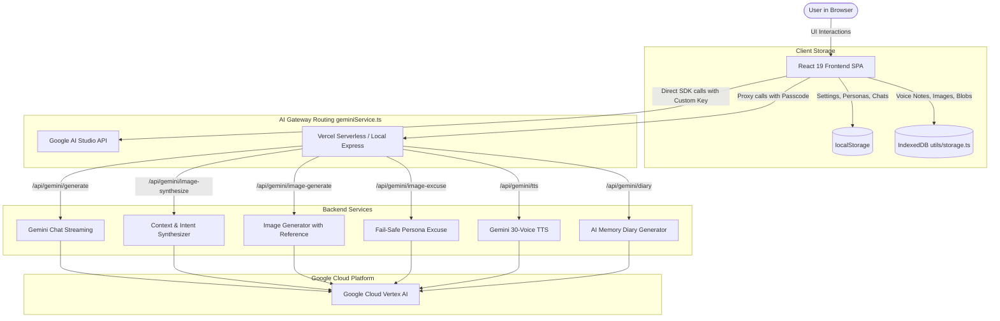
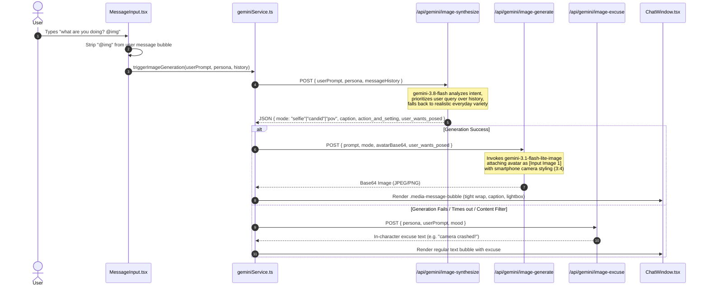
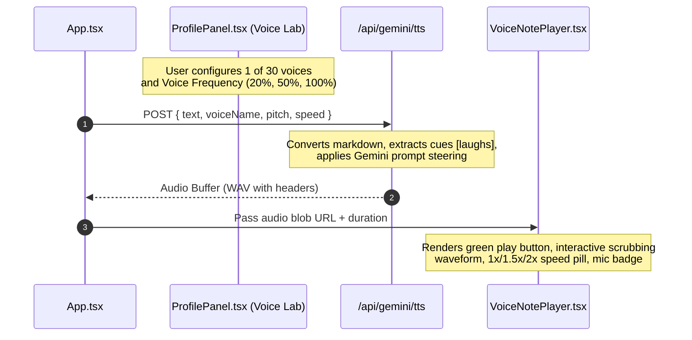

# Wassap System Architecture (`architecture.md`)

This document provides a comprehensive technical overview of the architecture, data flow, tech stack, and directory structure of the **Wassap Persona Simulation** platform (`v1.7.0`).

---

## 🏗️ 1. High-Level System Architecture

Wassap is structured as a client-first Single Page Application (SPA) designed to run with zero external database dependencies. All state is maintained client-side via `localStorage` and `IndexedDB`, while AI intelligence is routed through a dual-provider gateway:



---

## 🔄 2. Core Workflows & Data Pipelines

### A. In-Chat Realistic Smartphone Photo Generation (`@img`)



### B. Dual-Engine Audio & Gemini-TTS Pipeline



---

## 📂 3. Folder & File Structure

```
Wassap/
├── .github/                      # CI/CD and repository workflows
├── api/                          # Vercel Production Serverless Functions
│   └── gemini/
│       ├── generate.ts           # Streaming and non-streaming persona chat responses
│       ├── image.ts              # Consolidated multi-action image endpoint
│       ├── image-synthesize.ts   # Step 1: Context & intent synthesizer
│       ├── image-generate.ts     # Step 2: Realistic smartphone image generator
│       ├── image-excuse.ts       # Step 3: Camera error in-character excuses
│       ├── tts.ts                # 30-Voice Gemini-TTS voice synthesis
│       ├── diary.ts              # Persona diary generator for memory bubbles
│       └── status.ts             # Health check & credentials diagnostic endpoint
├── components/                   # Modular React UI Components
│   ├── CalendarNotesWidget.tsx   # Shared notes & real-time context panel
│   ├── ChatList.tsx              # Left sidebar conversation list with unread counters
│   ├── ChatWindow.tsx            # Main chat viewport, message cards, grouping, media bubbles
│   ├── ConfirmationModal.tsx     # Generic confirmation dialog for deletions/resets
│   ├── GuidePanel.tsx            # In-app user manual & tips
│   ├── ImageLightboxModal.tsx    # Full-screen media viewer with download capability
│   ├── MessageInput.tsx          # Message composer, @img trigger, audio recording, emoji/events
│   ├── MobileActionFAB.tsx       # Floating Action Button for mobile screen transitions
│   ├── MobileNavigation.tsx      # Bottom navigation bar for mobile viewports
│   ├── NewChatPanel.tsx          # Persona creation & search interface
│   ├── NewGroupPanel.tsx         # Multi-persona group chat creator
│   ├── ProfilePanel.tsx          # Comprehensive persona editor (Voice, Sentience, Schedule, Humane)
│   ├── SettingsPopover.tsx       # Global preferences (Providers, Keys, Passcode, Wallpaper, Models)
│   ├── Sidebar.tsx               # Left navigation rail (Chats, Communities/Guide, Updates, Settings)
│   ├── UpdatesPanel.tsx          # In-app changelog timeline
│   ├── UserProfilePanel.tsx      # Personal user profile info
│   └── VoiceNotePlayer.tsx       # WhatsApp audio note card with waveform scrubber & speed pill
├── server/                       # Local Development Backend
│   ├── api.ts                    # Express router forwarding /api/gemini/*
│   └── vertexHandler.ts          # Server-side Vertex AI implementation mirror
├── services/
│   └── geminiService.ts          # Client-side gateway orchestrator (routes Vertex vs AI Studio)
├── utils/
│   ├── audio.ts                  # Web Audio API recording, PCM converter, WAV header builder
│   ├── dates.ts                  # WhatsApp date formatter ("Today", "Yesterday", 24h clock)
│   ├── imageCompressor.ts        # Client-side canvas image compression
│   └── storage.ts                # IndexedDB persistence for large audio & image blobs
├── public/                       # Static public assets (wallpapers, default avatars)
├── App.tsx                       # Root application component & global state orchestrator
├── constants.ts                  # Default personas, templates, wallpapers, model catalogues
├── index.css                     # Tailwind CSS base & custom WhatsApp variables
├── index.html                    # HTML entry point
├── index.tsx                     # React DOM root mounting
├── tailwind.config.js            # Tailwind v3 layout configuration
├── tsconfig.json                 # TypeScript compiler options
├── types.ts                      # Core TypeScript domain models
├── vercel.json                   # Vercel serverless routing & function definitions
└── vite.config.ts                # Vite build and dev server configuration
```

---

## 🛠️ 4. Technology Stack

| Layer | Technology | Purpose & Details |
| :--- | :--- | :--- |
| **Frontend Framework** | **React 19** (`react`, `react-dom`) | Modern component architecture, state management with hooks |
| **Language** | **TypeScript 5.8** | Strict static typing across frontend, models, and serverless handlers |
| **Build Tooling** | **Vite 6** (`@vitejs/plugin-react`) | High-speed HMR development and production asset bundling |
| **Styling** | **Tailwind CSS v3.4** + Custom CSS | WhatsApp theme tokens, CSS variables, dark mode class strategy |
| **Icons** | **Lucide React** (`lucide-react`) | Pixel-accurate WhatsApp UI icon representations |
| **Client AI SDK** | **`@google/genai` v1.38+** | Official Google GenAI SDK for AI Studio and Vertex AI |
| **Audio Processing** | **Web Audio API** | Microphone PCM capture, sample-rate resampling, WAV header assembly |
| **Local Backend** | **Express 4** | Local development proxy for Vertex AI endpoints |
| **Serverless Engine** | **Vercel Functions** (`@vercel/node`) | Zero-config serverless API deployment in `/api/gemini/*` |
| **Client Storage** | **`localStorage` & IndexedDB** | Lightweight text state + robust binary blob persistence |

---

## 🔐 5. Authentication & Environment Configuration

Wassap employs a dual-credential resolution architecture:

1. **Service Account JSON**:
   - `GCP_SERVICE_ACCOUNT_KEY`, `GOOGLE_APPLICATION_CREDENTIALS_JSON`, or `GOOGLE_CREDENTIALS`.
2. **Individual Service Account Keys**:
   - `GCP_CLIENT_EMAIL` (or `VERTEX_CLIENT_EMAIL`)
   - `GCP_PRIVATE_KEY` (or `VERTEX_PRIVATE_KEY`) with automated `\n` normalization and PEM reconstruction.
3. **API Key Fallback**:
   - `VERTEX_API_KEY`, `GEMINI_API_KEY`, or `API_KEY`.
4. **Passcode Protection**:
   - Built-in cloud endpoints require the `x-vertex-passcode` header matching `VERTEX_PASSCODE` (`Ness2020`).
